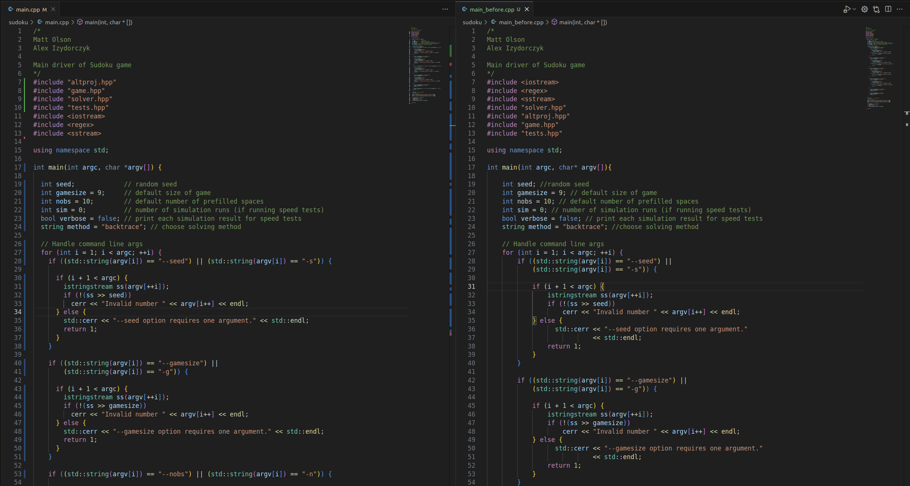
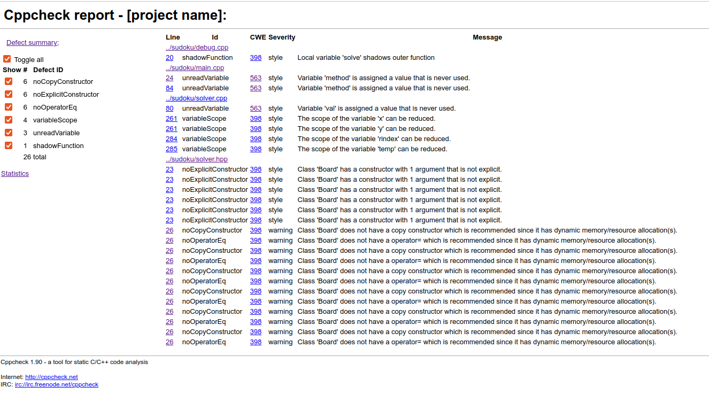

# Izveštaj sprovedene analize

Korišćeni alati:
- [Clang-format](#clang-format)
- [Cppcheck](#cppcheck)
- [Valgrind alati](#valgrind)
    - [Cachegrind](#cachegrind)
    - [Callgrind](#callgrind)
- [Lcov](#lcov)

## Clang-format
**Clang-format** je alat koji automatski formatira izvorni kod C, C++ i srodnih jezika prema zadatim stilskim pravilima (style guides).   
Njegova primarna svrha nije analiza funkcionalnosti, nego osiguranje konzistentnog i čitljivog koda, što indirektno pomaže u verifikaciji softvera jer olakšava pregled i smanjuje mogućnost grešaka u čitanju ili održavanju koda.

### Efekti primene na projekat
1. **Uniformnost i preglednost koda**  
   - clang-format je automatski izjednačio stil indentacije, razmake oko operatora i razmake između komentara i koda. Kod sada ima konzistentan raspored što olakšava čitanje i održavanje.

2. **Redosled include fajlova**  
   - Primetno je da je alat promenio redosled #include direktiva, prvo stavljajući standardne biblioteke (\<iostream\>, \<regex\>, \<sstream\>), a zatim lokalne fajlove ("solver.hpp", "altproj.hpp", "game.hpp", "tests.hpp"). Ovo je u skladu sa preporučenim praksama i olakšava vizuelnu organizaciju fajlova.

3. **Smanjenje vizuelne buke**  
   - Duži if uslovi i blokovi su sada razbijeni i lepo poravnati, što smanjuje rizik od grešaka i olakšava brzo skeniranje koda prilikom debugovanja ili verifikacije.

4. **Standardizacija komentara i razmaka**  
   - Razmak između komentara i koda je sada konzistentan (// comment), što doprinosi profesionalnijem i čitljivijem izgledu projekta.

5. **Nema promene logike**  
   - Važno je istaći da clang-format ne menja funkcionalnost koda, samo stil. Kod radi identično kao pre, ali je sada stilistički uniforman, što je posebno korisno kada se radi verifikacija softvera ili kada više developera radi na istom projektu.

### Zaključak
Iako je deo koda već dobro organizovan, veći deo fajlova još uvek nije uniforman i stil nije konzistentan. Primena `clang-format` na ceo projekat će značajno poboljšati preglednost, olakšati održavanje i smanjiti mogućnost grešaka prilikom verifikacije softvera. Ovo je posebno važno kada više developera radi na istom projektu ili kada se priprema kod za dalju analizu i testiranje.

## Cppcheck

Cppcheck je statički analizator koda za C i C++ koji pronalazi greške u kodu, potencijalne bugove i sigurnosne probleme **bez pokretanja programa**. Za razliku od kompajlera, Cppcheck se fokusira na **logičke i stilističke greške**, uključujući nedefinisano ponašanje, curenje memorije i lošu praksu kodiranja.

### Efekti primene na projekat

**1. Variable 'method' is assigned a value that is never used**  
   - Promenljiva `method` dobija vrednost koja se nigde dalje ne koristi.  
   - Ova situacija može ukazivati na nepotreban kod ili grešku u logici, pa je preporučljivo ukloniti ili koristiti promenljivu.

**2. Local variable 'solve' shadows outer function**  
   - Lokalna promenljiva `solve` ima isto ime kao spoljašnja funkcija ili promenljiva u višem opsegu.  
   - To može dovesti do zabune i neočekivanih rezultata, preporučuje se da se promeni ime lokalne promenljive.

**3. Variable 'val' is assigned a value that is never used**  
   - Promenljiva `val` dobija vrednost koja se nikada ne koristi.  
   - Ovaj problem je indikator mrtvog koda koji može biti uklonjen ili revidiran.

**4. The scope of the variable 'x' can be reduced**  
   - Promenljiva `x` je definisana u širem opsegu nego što je potrebno.  
   - Preporučuje se da se njen opseg smanji na minimum kako bi kod bio čitljiviji i smanjio mogućnost grešaka.

**5. Class 'Board' has a constructor with 1 argument that is not explicit**  
   - Konstruktor klase `Board` sa jednim argumentom nije označen kao `explicit`.  
   - To može dovesti do implicitnih konverzija i neočekivanog ponašanja.  
   - Rešenje: dodati `explicit` ispred konstruktora:

6. **Class 'Board' does not have a copy constructor which is recommended since it has dynamic memory/resource allocation(s)**  
   - Klasa `Board` koristi dinamičku memoriju ili resurse, ali nema definisan copy constructor.  
   - Bez copy konstruktora kopiranje objekata može dovesti do **deep copy** problema ili curenja memorije.  
   - Rešenje: implementirati copy constructor i, po potrebi, operator dodele (`operator=`).

### Zaključak     
Analiza pomoću Cppcheck-a nam je omogućila da identifikujemo **mrtvi kod, potencijalne greške u logici, problematične opsege promenljivih i rizike vezane za upravljanje memorijom**. Popravljanje ovih problema povećava kvalitet i stabilnost koda i smanjuje rizik od runtime grešaka.

## Valgrind

## Cachegrind 

## Callgrind

## Lcov
LCOV je alat za merenje i vizualizaciju pokrivenosti koda (code coverage) u C i C++ projektima. Koristi se u kombinaciji sa GCC instrumentacijom `--coverage flag` i `gcov` fajlovima, kako bi se prikazalo koji delovi koda su izvršeni tokom testiranja.

### Efekti primene LCOV alata na projekat

**1. Ukupna pokrivenost koda**  
Rezultati LCOV analize pokazuju da je prosečna **pokrivenost linija koda 54.5%**, dok je **pokrivenost funkcija 63.3%** u okviru Sudoku projekta.  
Na nivou celog projekta (uključujući biblioteke), ukupna pokrivenost linija je **43.8%**, a funkcija **44.5%**.  
Ovi rezultati ukazuju da je značajan deo logike obuhvaćen testovima, ali da postoji prostor za poboljšanje, naročito u delovima koda koji se ređe izvršavaju tokom testiranja.

**2. Pokrivenost po fajlovima**  
- `solver.cpp` pokazuje **najveći stepen pokrivenosti** (83.2% linija, 88.9% funkcija), što znači da su testovi najviše fokusirani na deo koda zadužen za rešavanje Sudoku problema.  
- `game.cpp` ima **solidnu pokrivenost (69.8%)**, što sugeriše da su osnovne funkcionalnosti igre testirane, ali ne i sve grane logike.  
- `main.cpp`, `altproj.cpp` i `tests.cpp` imaju **niske vrednosti pokrivenosti (0–28%)**, što ukazuje da deo koda za inicijalizaciju i test harness nije bio obuhvaćen aktivnim testovima.  
- Header fajlovi (`.hpp`) logično nemaju direktnu pokrivenost, jer sadrže deklaracije, ali njihova funkcionalnost se meri indirektno kroz implementacije u `.cpp` fajlovima.

**3. Analiza po direktorijumima**  
U poređenju direktorijuma, samo projektni folder (`/sudoku`) ima značajnu pokrivenost, dok sistemski direktorijumi (`armadillo_bits`, `c++/9/bits`, itd.) imaju veoma nisku pokrivenost (<10%), što je očekivano jer predstavljaju biblioteke standardne implementacije, a ne deo projekta.

**4. Vizuelni pregled i interpretacija boja**  
- **Zelena** boja označava potpuno pokrivene delove koda.  
- **Žuta** označava delimičnu pokrivenost.  
- **Crvena** pokazuje delove koda koji nisu pokriveni testovima.  
U tvom projektu, većina fajlova sadrži kombinaciju žutih i crvenih delova, što vizuelno potvrđuje da testovi još nisu sveobuhvatni.

### Zaključak
Analiza LCOV alata pokazuje da su testovi projekta ostvarili solidan nivo pokrivenosti, ali da postoji prostor za dalji napredak. Najbolje rezultate postižu fajlovi koji sadrže ključnu logiku, poput `solver.cpp`, dok su delovi odgovorni za ulazno-izlazne operacije i kontrolu toka igre slabije obuhvaćeni testovima. Ovakav rezultat ukazuje na potrebu za proširenjem test skupa, naročito u oblastima koje obuhvataju rubne slučajeve i alternativne grane izvršavanja koda.  
